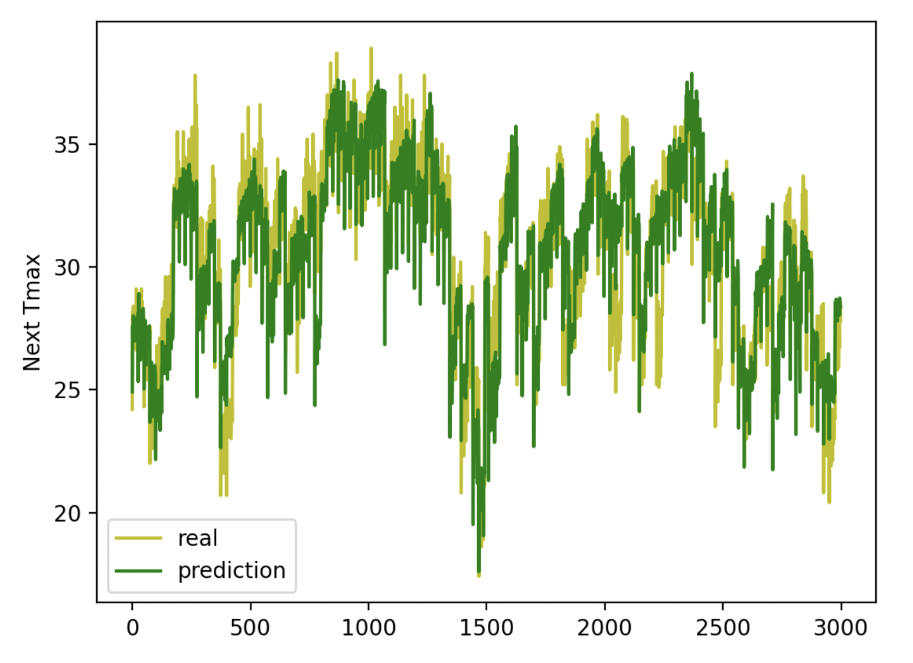
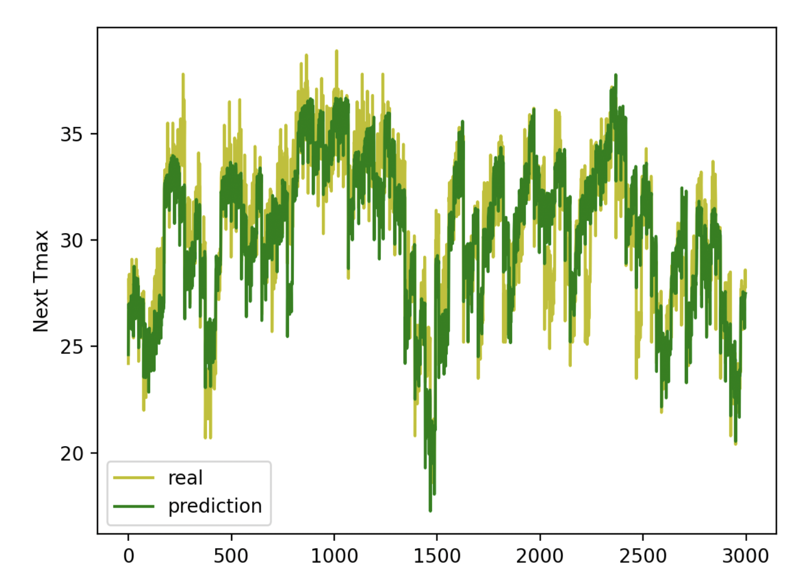
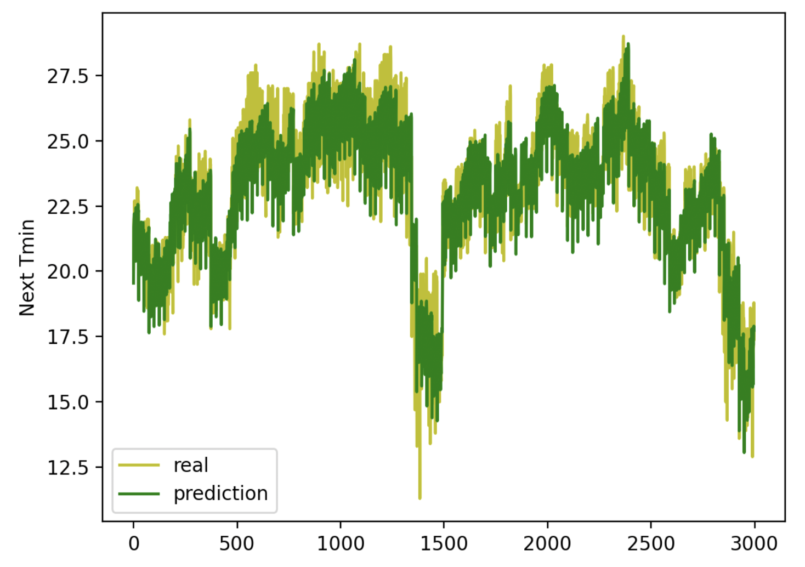
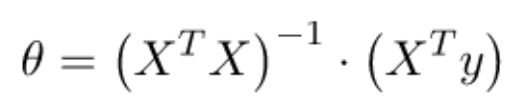
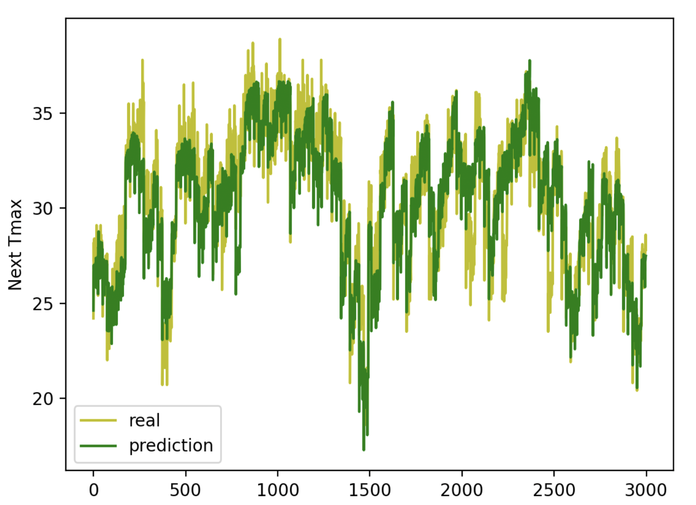
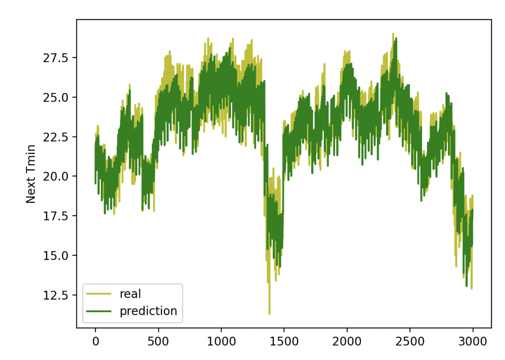
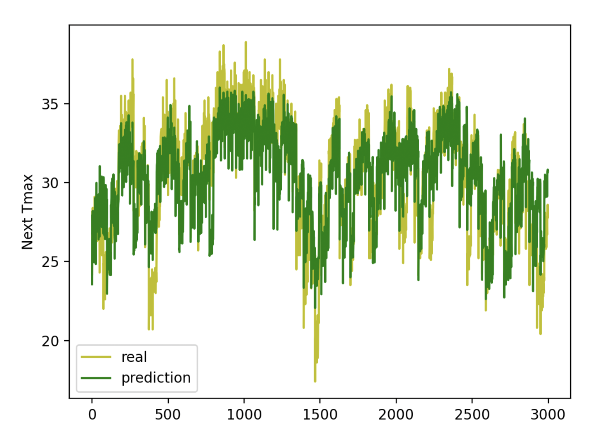

# Prediction of maximum and minimum temperature for the next day
One of the critical tasks in the industry is predicting environmental measures such as pressure or temperature. 
We have used a dataset for bias correction of next-day maximum and minimum air temperatures forecast of the LDAPS model operated by the Korea Meteorological Administration over Seoul, South Korea.

The dataset consists of summer data from 2013 to 2017. The input data comprises the LDAPS model's next-day forecast data, in-situ maximum and minimum present-day temperatures, and auxiliary geographic variables. This data has two outputs (i.e., next-day maximum and minimum air temperatures).

We have used 2013-2015 data for training and 2016-2017 for tests.

## a. Preproccessing
We first loaded the dataset; We deleted invalid and incomplete data.
Finally, we separated the data after 2016 for testing and separated the data before 2016 for training.

## b. Single Target Regression
In the first step, we have tried to predict the maximum weather for the next day. For this reason, we have implemented the `GradientDescent` class. This class takes the learning rate as input and during the learning process, this model changes the learning rate in such a way that the regression model does not get stuck in the local minimum.
The `GradientDescent` class has two methods:
1. `do_regression`: This method learns the regression weights from the learning data and adjusts the learning rate.
2. `predic_y`: This method makes predictions by taking test data using learned weights.

<div align="center">

</div>

```
Sum of squared errors (SSE): 7829.74
Mean of squared errors (MSE): 2.61
```

## c. Multi Target Regression
Regression refers to a predictive modeling problem that involves predicting a numerical value.
In multioutput regression, typically the outputs are dependent upon the input and upon each other. This means that often the outputs are not independent of each other and may require a model that predicts both outputs together or each output contingent upon the other outputs.

Therefore, in the second step, we have tried to predict the maximum and minimum weather of the next day at the same time. For this purpose, we have implemented the MultiTargetRegression class with two methods, `GradientDescent` and `NormalEquation`.

### c-1. GradientDescent class:
The GradientDescent class takes the learning rate as an input and, like the SingleTargetRegression class, it has implemented two methods: do_regression and predic_y.

The following diagram shows the output of this model on test data (for max temp):
<div align="center">

</div>

```
Sum of squared errors (SSE): 7572.1468
Mean of squared errors (MSE): 2.52
```

The following diagram shows the output of this model on test data (for min temp):
<div align="center">

</div>

```
Sum of squared errors (SSE): 2917.5780
Mean of squared errors (MSE): 0.97
```


### c-2. NormalEquation class:
In the NormalEquation class, the following formula is used instead of the approximate calculation of weights.
<div align="center">


</div>
The following diagram shows the output of this model on test data (for max temp):
<div align="center">

</div>

```
Sum of squared errors (SSE): 7572.1463
Mean of squared errors (MSE): 2.52
```

The following diagram shows the output of this model on test data (for min temp):
<div align="center">

</div>

```
Sum of squared errors (SSE): 2917.5783
Mean of squared errors (MSE): 0.97
```


## d. K Neighbors Regression
we have implemented `KNeighborsRegression`.In this method, for each point, we find the K nearest points and average their results.

The following diagram shows the output of this model on test data (for max temp):
<div align="center">

</div>

```
Sum of squared errors (SSE): 13429.76
Mean of squared errors (MSE): 4.47
```

